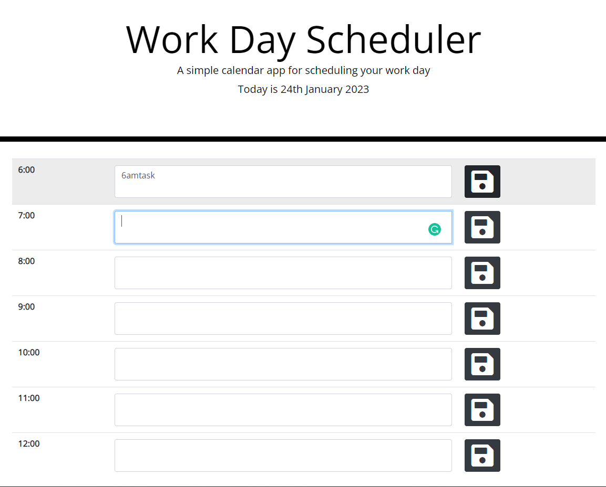

# Planner
It is a basic planner appication in Javascript

# Description
Basic planer to maintaing date, hours of the day and tasks assigned and save to the specific hour. 

# Visuals

# Usage
1. Each row is described on the left and represents hour of the day
2. Type your note to save into provided input field
3. Hit floppy disc image to save input
4. Refresh the page - now your input is being stored

